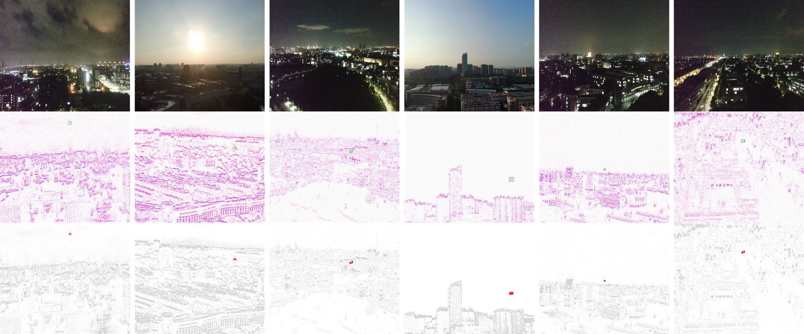
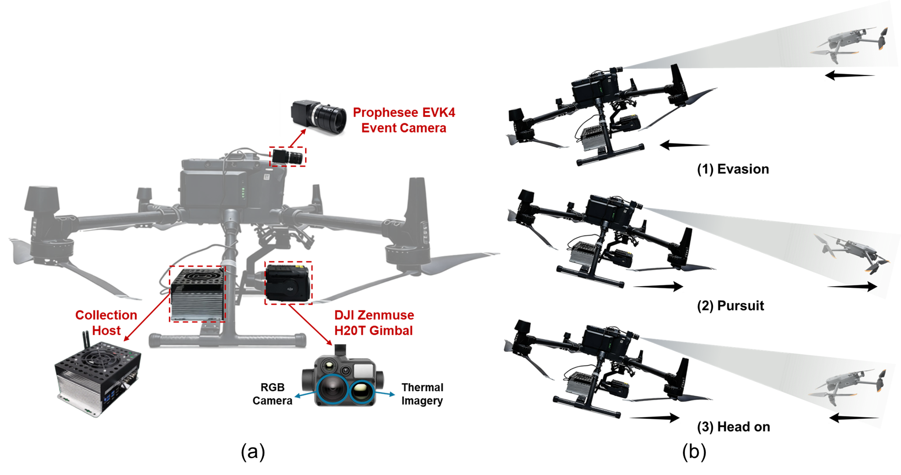
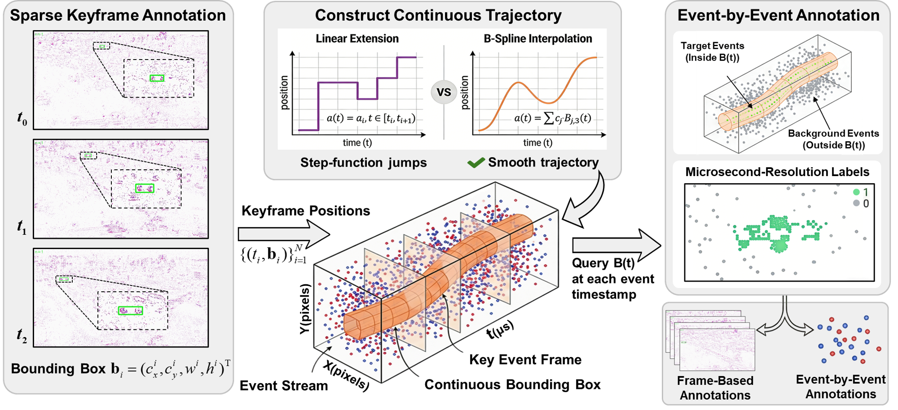

# AE-UAV: An Air-to-Air Event-Based UAV Tracking Benchmark

> **Status:** 📄 Submitted to *IEEE Transactions on Geoscience and Remote Sensing (TGRS)*, Under Review.

Official repository for the paper **"AE-UAV: An Air-to-Air Event-Based UAV Tracking Benchmark and a Real-Time Frequency-Domain Tracker."**

AE-UAV is, to the best of our knowledge, the **first airborne-captured event camera dataset for air-to-air (A2A) UAV tracking**. It comprises **178 flight sequences** with **continuous-time cubic B-spline annotations** that yield $C^2$-continuous target trajectories and support evaluation at arbitrary temporal resolutions.

<p align="center">
  
</p>
<p align="center"><em>Representative scenes across urban skylines, backlit skies, and low-light night flights. Top: synchronized RGB reference; middle: accumulated event frames; bottom: labeled raw event points (target highlighted).</em></p>

---

## Table of Contents
- [Highlights](#highlights)
- [Dataset Overview](#dataset-overview)
- [Dataset Structure](#dataset-structure)
- [File Formats](#file-formats)
- [Continuous-Time Annotation Pipeline](#continuous-time-annotation-pipeline)
- [License](#license)

---

## Highlights
- **First A2A event-based UAV tracking benchmark** — captured from an aerial observer platform, not ground-to-air.
- **178 sequences**, ≈ **2,140 s**, over **8.15 billion events**, at **1280×720** resolution.
- **Continuous-time cubic B-spline annotations** ($C^2$-continuous), enabling consistent evaluation across temporal resolutions from a single annotation effort.
- **Multimodal auxiliary data**: synchronized RGB and thermal-infrared imagery.
- Covers diverse **motion geometries** (pursuit / evasion / head-on), **illumination** (daylight / backlit / night), and **trajectory** patterns.

---

## Dataset Overview

| Property | Value |
|---|---|
| Sequences | 178 |
| Total duration | ≈ 2,140 s |
| Total events | > 8.15 billion |
| Target events | 31.2 million (0.38% of all events) |
| Event resolution | 1280 × 720 |
| Annotation | Cumulative-frame keyframes + cubic B-spline continuous trajectories (event-level labels) |
| Auxiliary modalities | RGB (1920×1080), Thermal IR (640×512)|
| Splits | Train 125 / Val 18 / Test 35 |

### Acquisition System

The observer platform is a DJI Matrice 300 RTK carrying a Prophesee EVK4 HD event camera (1280×720, 12 mm fixed-focus lens) and a DJI Zenmuse H20T gimbal that provides RGB (1920×1080) and thermal-infrared (640×512) imagery. An onboard collection host records the streams, and an IMU logs six-axis motion at 200 Hz. The target platform is a DJI Mavic 3T. The inter-UAV distance ranges from 15 m to 100 m, producing target scales from point-like signatures to detailed structures.

<p align="center">
  
</p>
<p align="center"><em>Data acquisition system. (a) Sensor payload on the DJI Matrice 300 RTK observer platform. (b) The three relative motion geometries: evasion, pursuit, and head-on approach.</em></p>


## Dataset Structure

```
AE-UAV/
├─ 0709-193513/                                                  # one complete flight session
│  └─ 2025-07-09-19-35-13-1430-1445(110-190)/              # one data record (sequence)
│     ├─ 2025-07-09-19-35-13-1430-1445(110-190).h5                          # annotated raw event data
│     ├─ 2025-07-09-19-35-13-1430-1445(110-190)_interpolation_functions.pkl # B-spline interpolation functions
│     └─ 2025-07-09-19-35-13-1430-1445(110-190).txt                         # manually labeled cumulative-frame boxes
│  └─ ...
├─ 0715-191343/
├─ ...
├─ train_dataset.txt      # training split; one sample + description per line
├─ val_dataset.txt        # validation split
└─ test_dataset.txt       # test split
```

- **Flight-session folders** (e.g. `0709-193513`, `0715-191343`) group all sequences recorded in a single flight, named as `MMDD-HHMMSS`.
- Each **data-record** folder is one annotated sequence and contains three files that share the same base name.
- **Split files** (`train/val/test_dataset.txt`) list the sequences in each subset; each line contains a sample identifier and its description.

**Record naming convention.** Each record name follows the pattern
`YYYY-MM-DD-HH-MM-SS-Sstart-Send_tag(Fstart-Fend)`:

- `YYYY-MM-DD-HH-MM-SS` — the recording start time (e.g. `2025-07-09-19-35-13` → 2025-07-09 19:35:13).
- `Sstart-Send` — the sequence's time span in **seconds relative to the recording start** (e.g. `1430-1445` → the 1430–1445 s window).
- `(Fstart-Fend)` — the manually annotated **frame-index range** within the segment (e.g. `(110-190)`). Annotation frames are sampled at **15 fps**.

---

## File Formats

Each data record stores the three stages of the annotation pipeline (see below):

| File | Content |
|---|---|
| `*.h5` | Annotated raw event stream — per-event records carrying a binary target/background label (pipeline stage 3). |
| `*_interpolation_functions.pkl` | Fitted cubic B-spline trajectory (pipeline stage 2). Query it at any timestamp `t` to obtain the continuous bounding box `B(t) = (cx, cy, w, h)`. |
| `*.txt` | Sparse keyframe annotations — manually labeled bounding boxes on accumulated event frames (pipeline stage 1). |

---

## Continuous-Time Annotation Pipeline

Conventional event datasets assign a **constant** bounding box within each inter-keyframe interval, which mismatches the continuous nature of event streams and produces inconsistent ground truth when trackers are evaluated at different temporal resolutions. AE-UAV instead builds a **continuous-time trajectory** whose ground truth can be queried at any timestamp.

<p align="center">
  
</p>
<p align="center"><em>Continuous-time annotation pipeline: sparse keyframe boxes → cubic B-spline continuous trajectory → event-by-event microsecond-resolution labels.</em></p>

The pipeline has three stages:

**1. Sparse keyframe annotation.** Human annotators label bounding boxes on accumulated event frames at sparse keyframe timestamps, yielding $N$ observations $\{(t_i, \mathbf{b}_i)\}_{i=1}^{N}$, where $\mathbf{b}_i = (c_x^i, c_y^i, w^i, h^i)^\top$.

**2. Cubic B-spline interpolation.** Each box parameter $a \in \{c_x, c_y, w, h\}$ is modeled as a cubic B-spline curve

$$a(t) = \sum_{j=0}^{M-1} c_j \, B_{j,3}(t)$$

whose basis functions $B_{j,3}(t)$ guarantee **$C^2$ continuity** (smooth position, velocity, and acceleration). The control points are fitted by regularized least-squares — an interpolation-fidelity term plus a curvature penalty ($\lambda = 0.001$) that prevents overfitting — producing physically plausible trajectories rather than step-function jumps.

**3. Event-level labeling.** Given the fitted trajectory $\mathbf{B}(t)$, every event $e_k = (x_k, y_k, t_k, p_k)$ receives a binary label

$$\ell_k = \begin{cases} 1, & \text{if } (x_k, y_k) \in \mathcal{R}(\mathbf{B}(t_k)) \\ 0, & \text{otherwise} \end{cases}$$

where $\mathcal{R}(\mathbf{B}(t))$ is the rectangular target region at time $t$.

The pipeline produces **dual outputs**: frame-level annotations for conventional frame-based trackers, and event-level labels for methods operating at the native (microsecond) temporal resolution.


---

## License

This project is released under the [MIT License](LICENSE).
